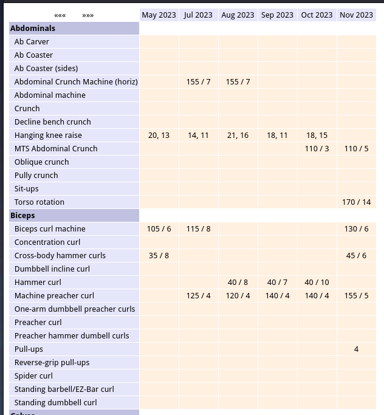
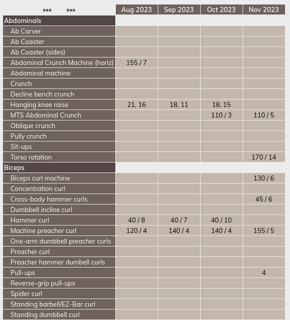

# Gym Workouts #

In the year 2000, I joined Bally's gym and wanted to keep a progress report of my workouts. It was originally an HTML page which was very tedious to maintain. I eventually created a PHP application to be able to add, edit, and delete entries.

Eventually, I added a feature where I could "scroll" left and right to reveal and hide different date ranges but display only 6 at a time. It has one major flaw: it retrieves ALL the data at once, renders all of them and then hides all but the last 6 via CSS:

### Python/Flask

I embarked on rewriting this in Python and Flask and to use AJAX to retrieve only the columns that need to be displayed, and scrolling left and right would retrieve one new column at a time:

One major challenge was that initial set of columns are not necessarily returned in order since XHR is normally asynchronous, and making synchronous is somewhat of an anti-pattern.

## Java/Spring

Python did not seem like the proper language for web applications. While frameworks like Django exist, they are nowhere close to Spring Boot in maturity and widespread adoption. This application was the intent to migrate the application to Java and Spring Boot.

This project has become and extremely low-priority project since the PHP version, warts and all, works exceptionally well.

## Unit Testing

Since this is a low-priority project, experimenting with it and breaking it is not a concern. As such, it is the project I used to experiment with JPA unit testing. Only two annotations are required to perform JPA testing: `@DataJpaTest` and `@ExtendWith`. In some cases, typically when `nativeQuery=true`, a better approach is to mock the repository and leverage Mockito's `when` feature. When entities match their respective tables and are not as the result of a `nativeQuery`, leveraging `data.sql` and `schema.sql` are a reasonable approach.
